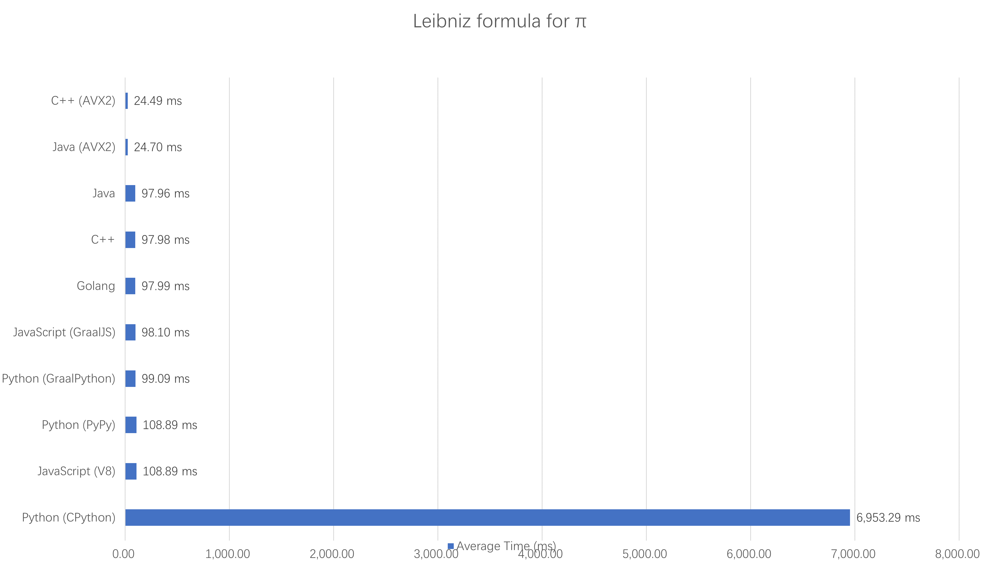

# Speed comparison of Leibniz Formula for π in multiple languages 

Based on [niklas-heer/speed-comparison](https://github.com/niklas-heer/speed-comparison).

The original benchmark results cannot reflect the real performance due to the measurement method.

This repo reimplement the benchmark for C++, Java, Golang, Python and JavaScript.
I run twenty rounds of benchmarking and count the average time spent on the last ten rounds.

## How to run it?

You need to install G++, Golang, OpenJDK 20, GraalVM, Python3, PyPy3, GraalPython, NodeJS,
and set the environment variable `GRAALVM_HOME`.

When you're done configuring, run `run.sh`.

## Results

Testing platform:

* OS: Ubuntu 22.04
* CPU: Ryzen 7 5800X

Software version:

* GCC: 11.4.0
* Java: 20.0.2
* GraalVM: Oracle GraalVM for JDK 20.0.2
* Go: 1.21.0
* CPython: 3.10.12
* PyPy: 7.3.9
* NodeJS: 12.22.9

Results:

[raw data](./logs/2023-08-14-1.log)